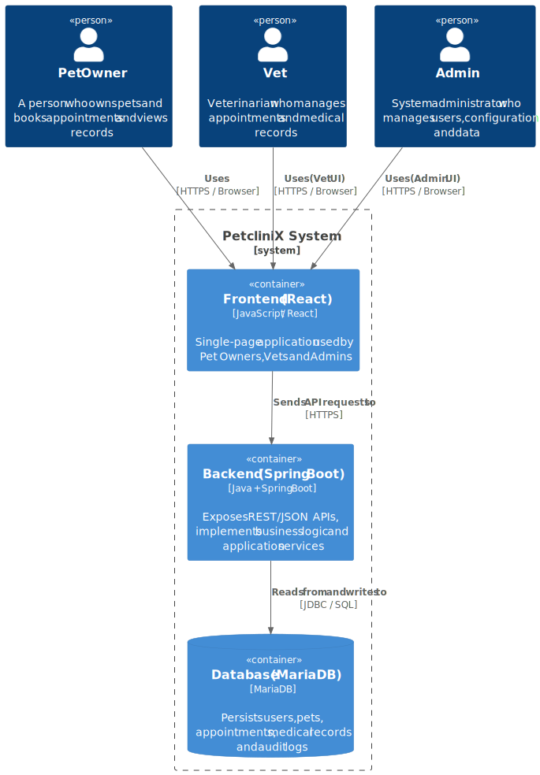

# Java Spring Boot and React with multitier architecture

The classical tech stack with Java and Spring Boot for backend and single-page application with React for frontend as multitier architecture.
The implementation follows a feature based folder structure.

Project structure:
```
/
├── backend/               # Java Spring Boot backend   
└── frontend/              # React frontend
└── ingress/               # Gateway ingress for routing
```



This follows a multitier architecture where the frontend and backend are separate applications communicating over HTTP. 
The backend exposes RESTful APIs that the frontend consumes. The ingress/gateway routes external requests to the appropriate 
service (frontend or backend) based on the URL path.
Backend uses a pragmatical layered architecture

For details about backend implementation, see [backend/README.md](backend/README.md).

# Usage
## Prerequisites
- Docker or Podman installed on your machine
- (Optional) Kubernetes cluster if you want to deploy using Kubernetes manifests

## Start using docker compose
To build and start the application using Docker Compose, navigate to the root directory of the project and run the following command:

```bash
docker compose up --build
```
Open your web browser and go to `http://localhost:8080` to access the React frontend.
